  <h3>Fusing Intelligent Agent Systems, Biometric Dynamics, &amp; Offline Mesh Infrastructure</h3>
  
Software &amp; AI Systems Engineer building reliable distributed applications, custom developer tooling, and telemetry architectures.

 

<table width="100%">
  <tr>
    <td width="42%" align="center" valign="middle" style="border: none;">
      <video src="https://github.com/user-attachments/assets/4ee3be0a-0138-417e-b415-a64234d381e9" width="100%" height="auto" controls autoplay playsinline muted onclick="this.muted=false; this.currentTime=0; this.play();" ondblclick="this.currentTime=0; this.play();" style="border-radius: 12px; border: 1px solid rgba(255,255,255,0.08); box-shadow: 0 4px 20px rgba(0,0,0,0.3); display: block; cursor: pointer;"></video>
    </td>
    <td width="58%" valign="top" style="border: none; padding-left: 20px;">
      <h4>Aditya Andhalkar</h4>
      
<strong>Software &amp; AI Systems Engineer</strong>

      
I design high-density software platforms, embedded computer vision subsystems, and offline-first mobile mesh networks. My work emphasizes cryptographic data provenance, modular service decoupling, and clean, responsive interfaces. I enjoy building systems that solve hard architectural challenges rather than assembly of generic boilerplate.

      

        
        
      

    </td>
  </tr>
</table>

---

<table width="100%">
  <tr>
    <td width="50%" valign="top" style="border: none;">
      <h3>🚀 Current Focus &amp; Learning</h3>
      <ul>
        <li>🧠 <b>Intelligent Agents</b>: Designing self-correcting RAG architectures, custom tool-use engines, and semantic integrity verification layers.</li>
        <li>🔒 <b>Biometric Telemetry</b>: Refining keystroke behavioral modeling to enforce non-intrusive continuous authentication.</li>
        <li>📡 <b>Offline Protocols</b>: Optimizing Bluetooth Low Energy (BLE) message routing algorithms in sparse, dynamic peer topologies.</li>
        <li>🌱 <b>Learning &amp; Exploring</b>: Edge compiler optimizations, Android system internals, and low-level socket protocol design.</li>
      </ul>
    </td>
    <td width="50%" valign="top" style="border: none;">
      <h3>💡 Engineering Philosophy</h3>
      <ul>
        <li>🛡️ <b>Lineage is Truth</b>: Data, recommendations, and AI findings must have verifiable origins. Provenance is non-negotiable.</li>
        <li>🔌 <b>Offline-First Resilience</b>: Network failure should be a transition, not a crash. Core operations must function locally and sync seamlessly.</li>
        <li>🎨 <b>High-Density UI/UX</b>: Interfaces should maximize information density without adding noise. Visual depth is achieved through typography, grid alignment, and clean micro-interactions.</li>
      </ul>
    </td>
  </tr>
</table>

---

### 🛠️ Developer Inventory (Tech Stacks)

<table width="100%">
  <tr>
    <td width="50%" valign="top">
      <b>🌐 Frontend Stack</b> 
      <code>React 19</code> • <code>Next.js</code> • <code>TypeScript</code> • <code>Tailwind v4</code> • <code>D3.js</code> • <code>TanStack Router</code> • <code>HTML5</code>
    </td>
    <td width="50%" valign="top">
      <b>🎛️ Backend &amp; Service Stack</b> 
      <code>FastAPI</code> • <code>Node.js</code> • <code>Flask</code> • <code>REST / SSE</code> • <code>Python</code> • <code>Kotlin</code>
    </td>
  </tr>
  <tr>
    <td width="50%" valign="top">
      <b>🧠 AI &amp; Machine Learning</b> 
      <code>Gemini Orchestration</code> • <code>Scikit-Learn</code> • <code>OpenCV</code> • <code>Picovoice APIs</code>
    </td>
    <td width="50%" valign="top">
      <b>⚙️ Infrastructure &amp; Caching</b> 
      <code>Docker</code> • <code>PostgreSQL</code> • <code>Supabase</code> • <code>SQLite Local Caching</code> • <code>Wrangler CLI</code> • <code>Bun</code>
    </td>
  </tr>
</table>

---

### 📂 Featured Systems & Engineering Works

#### 📡 [Adika AI](https://github.com/Adi3182004/Adika-Ai-Interviewer)
> **Commercial-Grade AI Career Intelligence & Adaptive Mock Interviewing Platform**
> 
> | Attribute | Implementation & Architecture |
> | :--- | :--- |
> | **Problem** | Hiring and practice pipelines rely on static resume parsing or easily-gamed matching models, lacking interactive assessment depth. |
> | **Core Solution** | An adaptive interviewing agent that conducts live mock sessions. The AI dynamically routes follow-up questions to probe candidate weaknesses and designs custom, week-by-week study schedules to close competency gaps. |
> | **Tech Stack** | React 19, TanStack Start & Router, Tailwind CSS v4, Supabase (Auth/DB), Google Gemini API. |

 

#### 🕵️ [EvidenceOS](https://github.com/Adi3182004/Evidence-OS)
> **Enterprise-Grade Digital Forensics & Incident Investigation Platform**
> 
> | Attribute | Implementation & Architecture |
> | :--- | :--- |
> | **Problem** | Forensics and security teams must parse huge silos of EXIF metadata, syslog timestamps, and chat exports without losing evidence chain-of-custody. |
> | **Core Solution** | A collaborative intelligence dashboard (Palantir-modeled). It maps suspect activity timelines, schedules tasks, and links data points in interactive knowledge networks backed by verified cryptographic records. |
> | **Tech Stack** | React, Vite, Tailwind CSS, Python (FastAPI/Uvicorn), PostgreSQL/Supabase, D3.js. |

 

#### 📨 [SilentNet](https://github.com/Adi3182004/SilentNet)
> **Decentralized Offline Mesh Communication & Device Recovery Suite**
> 
> | Attribute | Implementation & Architecture |
> | :--- | :--- |
> | **Problem** | Centralized communication networks become congested or completely unavailable during natural disasters, local power failures, or grid outages. |
> | **Core Solution** | A local-first messenger and recovery engine. Android devices form independent mesh nodes, using Bluetooth Low Energy (BLE) protocols for discovery, forwarding, and location telemetry. |
> | **Tech Stack** | Kotlin, Android Studio, BLE Mesh APIs, SQLite, custom cryptographic wrappers. |

 

#### 🎹 [Key-Strokebased-Auth](https://github.com/Adi3182004/Key-Strokebased-Auth)
> **Continuous Biometric Authentication Engine via Keystroke Dynamics**
> 
> | Attribute | Implementation & Architecture |
> | :--- | :--- |
> | **Problem** | Standard multi-factor logins only verify identity once at login. If a session is hijacked post-auth, traditional security systems remain blind. |
> | **Core Solution** | Continual background validation that learns how a user types. It measures milliseconds between key down and key up states, running classification models to lock out anomalous typing profiles. |
> | **Tech Stack** | Python, Flask, Scikit-learn (Random Forest Classifier), Joblib, Twilio API. |

 

#### 👤 [TrueFace](https://github.com/Adi3182004/TrueFace)
> **Interactive AI Manipulation Detector & Media Verification Engine**
> 
> | Attribute | Implementation & Architecture |
> | :--- | :--- |
> | **Problem** | Deepfakes and synthesized media confuse traditional fact-checkers, making manual media forensics slow and error-prone. |
> | **Core Solution** | A media analysis application. It runs automated checks on uploaded file headers and metadata anomalies, integrated with a daily fact-checking quiz game. |
> | **Tech Stack** | React, TypeScript, Vite, Google Gemini API. |

---

### 🧬 Specialized Engines & Core Components

*   🛡️ **ChronoTwin**: Fused timeline reconstruction algorithm. Parses EXIF metadata, syslog timestamps, and Signal backups to detect logical sequencing errors and unexplained activity gaps.
*   🔑 **Knowledge DNA**: Fact provenance lineage model. Cryptographically logs the origin trail of AI observations, linking summaries back to raw file hashes (SHA-256) to guarantee evidence integrity.
*   👁️ **SilentEye**: Video vision analytics module. Implements live bounding-box trackers and license plate recognition (LPR) layers over active CCTV streams.
*   🎙️ **ASTRICK**: Speech command interface. A voice processing client utilizing local Picovoice APIs for offline voice assistants on device control layers.

---

### 📈 GitHub Statistics & Activity

  
    
  
  
   
  

 

  

---

### 🤝 Connect With Me

  
  
  
  

---

### 🖥️ Interactive System Map

  

